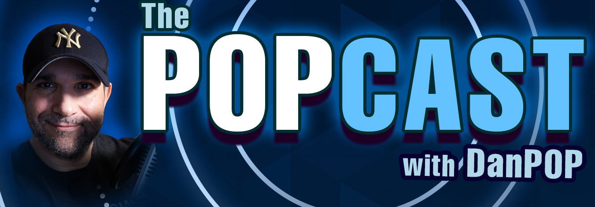

### POPCAST
The POPcast with Dan POP! Join host Dan "Pop" Papandrea as he has conversations with the fascinating people that are driving technology and thought leadership. We cover their personal stories and journeys,including their wins and losses, to deep dive into what it is like to lead through technology and new ways of thinking. The POPCAST is one of the world's first open source podcast where guests and questions are often driven through community contributors.  

# POPCAST's MISSION
The POPCAST's mission is to connect technical and thought leaders with the community and the audience that goes BEYOND JUST CODE.

## SHOW (Follow and Subscribe to our Youtube channel / Twitter!)
* Watch  (YouTube): https://www.youtube.com/c/thepopcastpop
* Listen (Apple PODCAST and others): http://popcast-d9f7b6dc.simplecast.com
* Follow us on (Twitter): https://twitter.com/PopcastPop
* Follow us on (Linkedin): https://www.linkedin.com/company/the-popcast-with-danpop

## Future Guests [get list](guestlist.md)
*WOULD LOVE TO SEE FOLKS CONTRIBUTE FOLKS THEY WOULD LIKE TO SEE!* I made a list of folks id like to talk to.  if you want to be on the POP feel free to a DR on the guestlist.md

## [AMAZING POPCAST ALUMNI](pastguests.md) 
Please note- that this list may or may not include @aclater as "amazing".  this is up to you the viewer or listener. 

## Questions you would like me to [ask guests](questions.md) 
You can clone and add questions for this weeks guest.  i will usually promote this on Twitter first the monday before the recording.

## Contributing
Pull requests are welcome. For major changes, please open an issue first to discuss what you would like to change.

## [Contributors](contributors.md) 
This is the list of amazing contributors

# Sponsor the POPCAST!
* If you're a company in the cloud native or devops space that would like an ad or sponsor a full episode of the POPCAST, please send a note to popcastsponsors @ gmail.com .  Portions of the profits post show expenses are donated to various charities that support the community and growth of individuals.

Plans Include
  * Single Ad's
  * Monthly
  * Sponsored/Affliliate Active episodes
  * Annual

# Current (Past) Sponsors
* Cockroach Labs
* Solo.io
* Kinvolk
* Giant Swarm
* Sysdig
* Tremolo Security
* Code Fresh
* StormForge (formerly Carbon Relay)

# [Who is Dan POP?](https://github.com/danpopSD/popcast/blob/master/popbio.png)
Dan "POP" Papandrea is the Lead-Open Source Community and Ecosystem @ Sysdig and is a CKA (Certified Kubernetes Administrator) and [CNCF Ambassador](https://www.cncf.io/people/ambassadors/) and [CDF Ambassador](https://cd.foundation/ambassador-program-overview-application/community-ambassador-cohort20/) POP spends his days learning and contributing to the orchestration and container ecosystem as well as working with customers on understanding their unique environments and how Sysdig can help them with their end project goals. Prior to Sysdig, POP was a lead solution architect for Hewlett Packard Enterprise's Helion business unit as well as the Director of IT, Principal Solutions Architect, Product Manager at SS&C Technologies a multinational financial services solution company. POP is the host of the hit podcast The POPCAST by Dan POP which explores the leaders and creators and stories behind the code.

## LEGAL DISCLAIMER
THE POPCAST IS PROVIDED "AS IS", WITHOUT WARRANTY OF ANY KIND, EXPRESS OR IMPLIED, INCLUDING BUT NOT LIMITED TO THE WARRANTIES OF MERCHANTABILITY, FITNESS FOR A PARTICULAR PURPOSE AND NONINFRINGEMENT. IN NO EVENT SHALL THE AUTHORS OR COPYRIGHT HOLDERS BE LIABLE FOR ANY CLAIM, DAMAGES OR OTHER LIABILITY, WHETHER IN AN ACTION OF CONTRACT, TORT OR OTHERWISE, ARISING FROM, OUT OF OR IN CONNECTION WITH THE POPCAST OR THE USE OR OTHER DEALING.  
